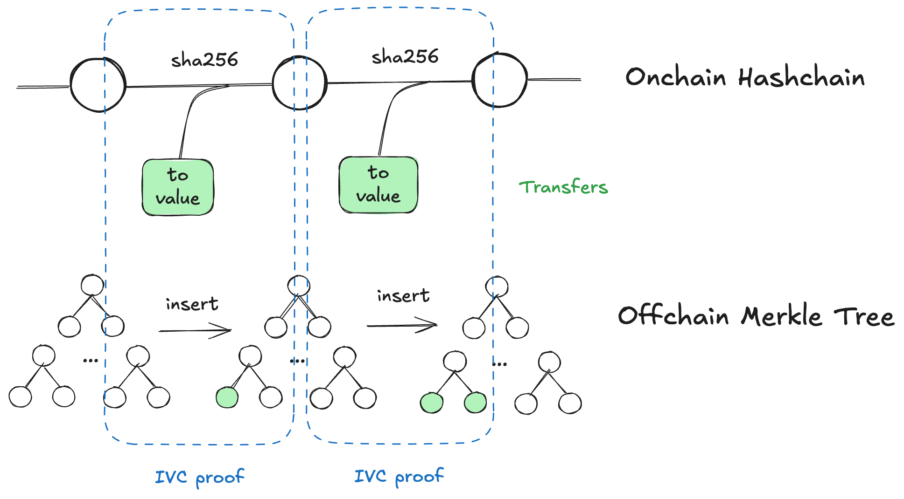
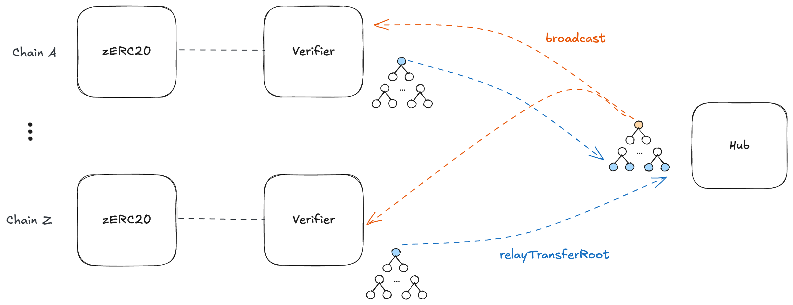

# Architecture Overview

This document explains how zERC20 is architected across on-chain contracts, off-chain services, and the Internet Computer (ICP) stealth messaging layer.

- **Privacy-preserving transfers**: Senders burn zERC20 to stealth addresses; recipients mint on the same or another chain without linkable on-chain metadata
- **ERC-20 compatibility**: Standard token interface works with existing wallets, DEXes, and DeFi protocols
- **Provable integrity**: Every mint relies on zero-knowledge proofs (Nova/Groth16)
- **Scalability**: Poseidon Merkle trees and IVC batch thousands of transfers into one proof
- **Cross-chain**: LayerZero-based hub aggregates roots across all chains

## On-Chain Contracts

| Contract | Purpose |
|----------|---------|
| **zERC20** | Upgradeable ERC-20 that emits `IndexedTransfer` events, maintains SHA-256 hash chain, and exposes `teleport` for verified mints |
| **Verifier** | LayerZero OApp that verifies Nova/Groth16 proofs, tracks teleported amounts per recipient, and relays roots to Hub |
| **Hub** | Aggregates transfer roots from all chains into a Poseidon tree, broadcasts global root to all Verifiers |
| **LiquidityManager** | Manages liquidity policy, handles wrap/unwrap of underlying assets |
| **Adaptor** | Cross-chain exit via Stargate when liquidity is more favorable on another chain |
| **SwapHelper** | Per-chain helper contract that atomically executes `permit + transferFrom + native payout` for relayer-managed token-to-native swaps |

## Off-Chain Services

| Service | Purpose |
|---------|---------|
| **Indexer** | Actix HTTP server + Postgres. Syncs on-chain events, maintains Merkle trees, generates root proofs |
| **Decider Prover** | HTTP worker that finalizes Nova proofs for on-chain verification |
| **Cross-chain Job** | Relays transfer roots to Hub and triggers broadcasts |
| **Relay Node** | HTTP service that can submit gasless redeem transactions on behalf of users and swap zERC20 into native gas tokens |

## ICP Stealth Storage

| Component | Purpose |
|-----------|---------|
| **Key Manager Canister** | VetKD-backed IBE key derivation per EVM address |
| **Storage Canister** | Stores encrypted announcements and signed invoices |

## Data Flow

### 1. Transfer Emission

```
zERC20._update() → emits IndexedTransfer → updates hashChain
```

Every transfer (mint/transfer/burn) appends to the SHA-256 hash chain and emits an indexed event.

### 2. Root Proving

<div align="center">
  
</div>

The indexer maintains Poseidon Merkle trees and periodically proves new transfer roots on-chain using IVC proofs.

### 3. Cross-chain Aggregation

<div align="center">
  
</div>

Each chain's Verifier relays its transfer root to the Hub, which aggregates them and broadcasts the global root back to all Verifiers.

### 4. Private Transfer

```
Sender → zERC20 transfer to burn address → Recipient scans ICP storage →
Generates ZKP → Verifier.teleport() → zERC20 mints to recipient
```

### 5. Gasless Redeem and Get Gas

```
Recipient → signs fee authorization / ERC-2612 permit →
Relay Node → Verifier.(single)Teleport(...) or SwapHelper.swap(...) →
recipient receives zERC20 redemption or native gas token
```

- **Gasless redeem** lets users redeem eligible transfers without already holding destination-chain native gas.
- **Get Gas** lets users swap zERC20 into the destination chain's native token through the relay node.
- `SwapHelper` keeps the swap path atomic on-chain, so token transfer and native payout succeed or fail together.

## Cryptographic Primitives

| Primitive | Usage |
|-----------|-------|
| **Poseidon Hash** | Merkle trees, burn address derivation, recipient binding |
| **SHA-256** | Hash chain commitments (truncated to 248 bits for BN254) |
| **Nova Folding** | Batch withdrawal proofs, root transition proofs |
| **Groth16** | Single withdrawal proofs |
| **VetKD/IBE** | Encrypted stealth messaging on ICP |

## Trust Model

| Actor | Trust Assumption |
|-------|------------------|
| Contract Owner | Can upgrade contracts, rotate verifiers |
| Indexer Operator | Observes sender/burn-address/value; learns recipient on query |
| ICP Canisters | Stores encrypted data; cannot decrypt without recipient's key |

**For maximum privacy**: Run your own indexer instance to avoid sender-recipient linkage leaks.
