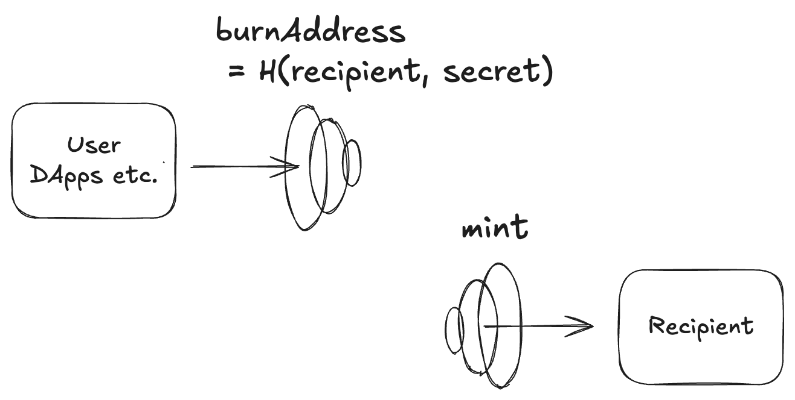

# How zERC20 Works

This page explains the mechanism behind zERC20's private transfers and what privacy guarantees it provides.

## Private Transfer Flow

  

### Step 1: Generate a Burn Address

Either the sender or recipient generates a **burn address**—a one-time Ethereum address with no corresponding private key. This address is derived cryptographically from the recipient's withdrawal address and a secret.

### Step 2: Send to the Burn Address

The sender transfers zERC20 to the burn address using any standard wallet (MetaMask, etc.). Since no private key exists for this address, the tokens are effectively "burned" and cannot be moved by anyone.

### Step 3: Withdraw with Zero-Knowledge Proof

The recipient generates a **zero-knowledge proof** that demonstrates:

- They know the secret used to derive the burn address
- The burn address received a specific amount of tokens

Using this proof, the recipient can withdraw the same amount to any address of their choice. The proof reveals nothing about which burn address corresponds to which withdrawal.

> We call this withdrawal process **"teleport"** because tokens effectively disappear from one address and reappear at another with no traceable link.

## What Is Private?

Understanding zERC20's privacy model is essential for using it securely.

### 1. Sender-Recipient Unlinkability

The relationship between the sender's address and the recipient's withdrawal address is **never published on-chain**. This is similar to how Tornado Cash hides the link between deposits and withdrawals.

### 2. Burn Address Visibility

The transaction sending zERC20 to a burn address **is publicly visible**. However, observers cannot determine which withdrawal address the burn address is linked to.

### 3. Who Knows What?

| Scenario                         | Sender Knows                   | Recipient Knows  | On-chain Observers Know           |
| -------------------------------- | ------------------------------ | ---------------- | --------------------------------- |
| Recipient generates burn address | Only the burn address          | Sender's address | Sender sent to an unknown address |
| Sender generates burn address    | Recipient's withdrawal address | Sender's address | Sender sent to an unknown address |

- **Recipient-generated burn address**: The sender only knows the burn address, not where funds will be withdrawn. This provides maximum privacy for the recipient.
- **Sender-generated burn address**: The sender must know the recipient's withdrawal address to generate the burn address. The recipient's address remains private from on-chain observers, but not from the sender.

> The Frontend currently supports sender-generated burn addresses. The CLI supports both methods.

### 4. Amount Privacy Considerations

Transfer and withdrawal amounts **are visible on-chain**. Unique or unusual amounts (e.g., 123.456789 zUSDC) could potentially be used to correlate transactions.

**Mitigation strategies:**

| Strategy                | Description                                                                                                                             |
| ----------------------- | --------------------------------------------------------------------------------------------------------------------------------------- |
| **Batch withdrawals**   | Combine multiple incoming transfers into a single withdrawal. Only the total amount is exposed on-chain.                                |
| **Partial withdrawals** | Withdraw less than the full amount received. For example, if you received 123.456789 zUSDC, withdraw 123 zUSDC and leave the remainder. |

## Crosschain Transfers

zERC20 supports private transfers across different blockchains:

1. Send zERC20 to a burn address on **any supported chain**
2. Withdraw to **any other supported chain**

Cross-chain messaging is handled by LayerZero, with a global Merkle tree aggregating all transfer roots across chains.

## Technical Overview

For developers interested in the underlying cryptography:

- **Merkle Trees**: Poseidon hash-based Merkle trees track all burns
- **Zero-Knowledge Proofs**: Nova folding schemes (batch) and Groth16 (single) prove withdrawal eligibility
- **Hash Chain**: SHA-256 hash chain ensures deterministic ordering of all transfers
- **Stealth Messaging**: VetKD-powered ICP canisters enable encrypted burn address delivery

See the [Architecture Overview](../developers/architecture.md) for complete technical details.
