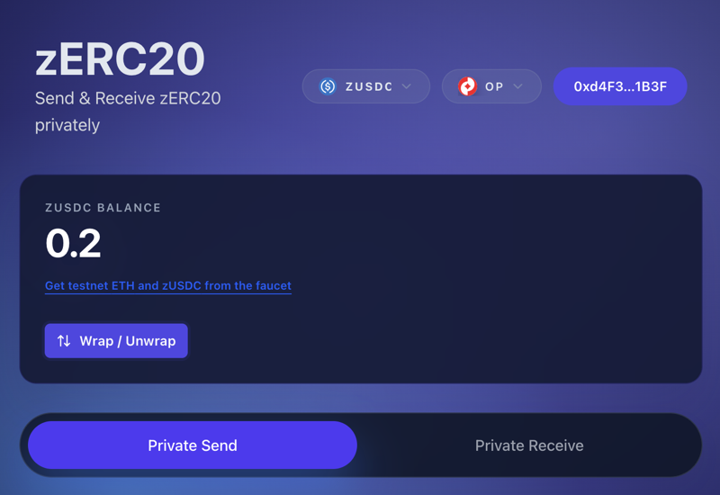
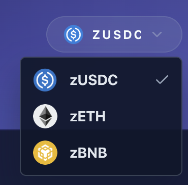
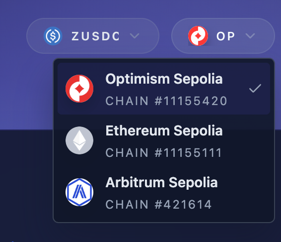
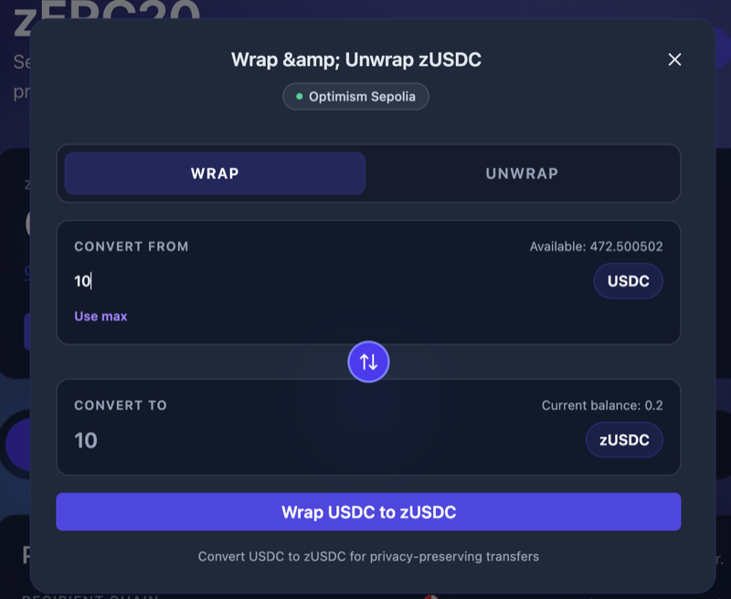
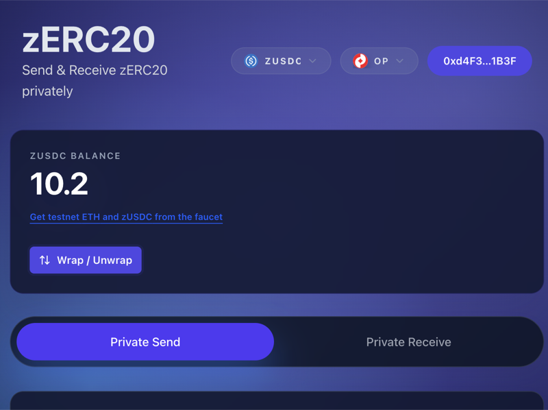
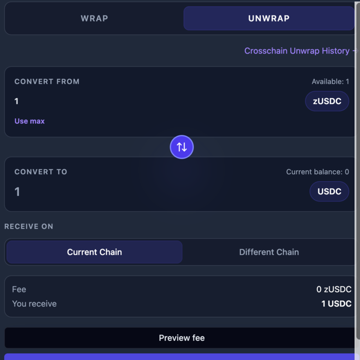
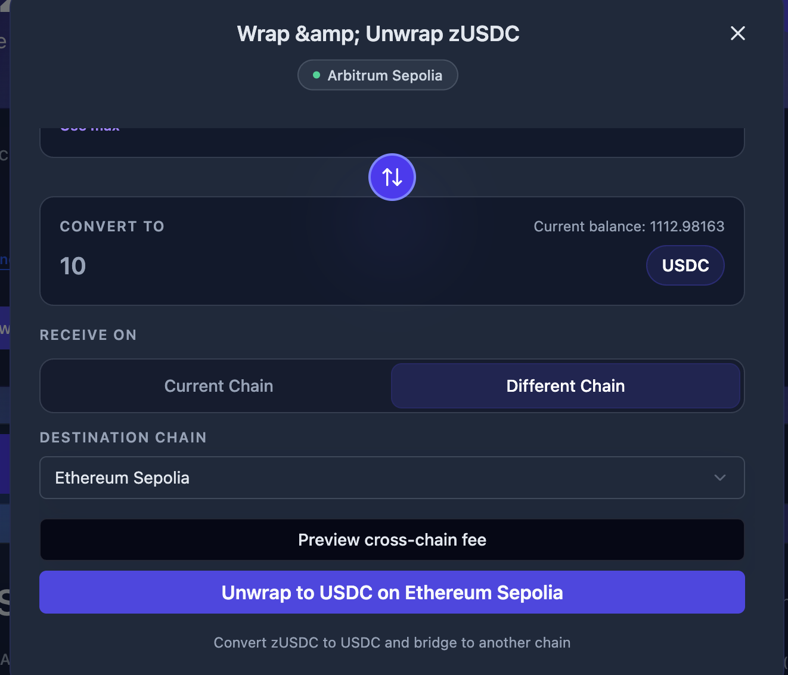

# Getting Started with Frontend

This guide walks you through using the zERC20 web application.

## Step 1: Access the Frontend

Visit the [zERC20 Frontend](https://v2.testnet.app.zerc20.io/).

<figure><figcaption>Dashboard Overview</figcaption></figure>

## Step 2: Connect Your Wallet

1. Click "Connect Wallet" in the top right corner
2. Select your wallet provider (MetaMask, WalletConnect, etc.)
3. Approve the connection request in your wallet

Once connected, your wallet address and token balances will be displayed in the dashboard.

## Step 3: Get zERC20 Tokens

zERC20 tokens are ERC-20 wrapper tokens backed 1:1 by underlying assets. These tokens enable private transfers while maintaining full compatibility with the ERC-20 standard.

You can select the token type and chain from the dropdowns at the top of the page:

| Token Selector | Chain Selector |
|:--------------:|:--------------:|
|  |  |

### Option A: Wrap Tokens

Wrapping converts your standard tokens (USDC, ETH, etc.) into zERC20 tokens at a 1:1 ratio.

1. Click the "Wrap / Unwrap" button
2. Ensure the "WRAP" tab is selected
3. Select the token you want to wrap (USDC, ETH, BNB, etc.)
4. Enter the amount to wrap

<figure><figcaption>Wrap Modal - Enter amount to convert</figcaption></figure>

5. Click "Wrap USDC to zUSDC" (or the appropriate token)
6. Confirm the transaction in your wallet
7. Receive an equivalent amount of zERC20 tokens

> **Wrap Rewards**: If the chain has low liquidity, you may receive bonus tokens as a reward for adding liquidity. See [Fees and Rewards](../fees-and-rewards.md) for details.

After wrapping, your balance will be updated:

<figure><figcaption>Dashboard showing updated zERC20 balance</figcaption></figure>

### Option B: Buy on a DEX

Purchase zERC20 directly on decentralized exchanges like Uniswap.

> Check [Contract Addresses](../../reference/addresses.md) for token addresses on each chain.

### Unwrapping zERC20 Tokens

To convert zERC20 tokens back to the underlying asset:

1. Click the "Wrap / Unwrap" button
2. Select the "UNWRAP" tab
3. Enter the amount to unwrap
4. Choose your receiving option

**Same Chain Unwrap:**

Select "Current Chain" to receive the underlying tokens on the same chain you're connected to.

<figure><figcaption>Unwrap to current chain</figcaption></figure>

**Cross-Chain Unwrap:**

Select "Different Chain" to unwrap and bridge to another chain in one transaction. This uses LayerZero for cross-chain messaging.

<figure><figcaption>Unwrap with cross-chain bridge to a different network</figcaption></figure>

You can preview the cross-chain fee before confirming the transaction.

> **Fee Optimization**: If unwrap fees are high on your current chain due to low liquidity, cross-chain unwrap lets you access liquidity from another chain with lower fees. The frontend shows fee comparisons so you can choose the best option. See [Fees and Rewards](../fees-and-rewards.md) for details.

## Step 4: Make a Private Transfer

See [Private Transfer Guide](private-transfer.md) for detailed instructions on sending.

See [Scan Receives Guide](scan-receives.md) for instructions on receiving transfers.

## Important Notes

- **Crosschain Capability**: You can send on one chain and withdraw on another using LayerZero messaging
- **Processing Time**: Private transfers typically take 30 minutes to 1 hour on mainnet
- **Testnet Limitations**: On testnets, transfers may take longer due to LayerZero instability

## Next Steps

- [Private Transfer (Frontend)](private-transfer.md) — Send and receive privately
- [FAQ](../faq.md) — Common questions and troubleshooting
