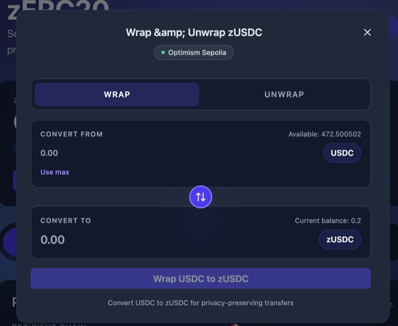

# Getting Started with Frontend

This guide walks you through using the zERC20 web application.

## Step 1: Access the Frontend

Visit the [zERC20 Frontend](https://v2.testnet.app.zerc20.io/).

## Step 2: Connect Your Wallet

1. Click "Connect Wallet"
2. Select your wallet provider (MetaMask, WalletConnect, etc.)
3. Approve the connection request

## Step 3: Get zERC20 Tokens

zERC20 tokens are ERC-20 wrapper tokens backed 1:1 by underlying assets.

You can select the token type and chain from the dropdowns at the top of the page:

### Option A: Wrap Tokens

1. Click the "Wrap / Unwrap" button
2. Select the token you want to wrap (USDC, ETH, BNB, etc.)
3. Enter the amount

4. Click "Wrap USDC to zUSDC" (or the appropriate token)
5. Confirm the transaction in your wallet
6. Receive an equivalent amount of zERC20 tokens

After wrapping, your balance will be updated:

### Option B: Buy on a DEX

Purchase zERC20 directly on decentralized exchanges like Uniswap.

> Check [Supported Chains](../../reference/chains.md) and [Contract Addresses](../../reference/addresses.md) for token addresses on each chain.

### Unwrapping zERC20 Tokens

To convert zERC20 tokens back to the underlying asset:

1. Click the "Wrap / Unwrap" button
2. Select the "UNWRAP" tab
3. Enter the amount to unwrap

**Same Chain Unwrap:**

**Cross-Chain Unwrap:**

Select "Different Chain" to unwrap and bridge to another chain in one transaction:

## Step 4: Make a Private Transfer

See [Private Transfer Guide](private-transfer.md) for detailed instructions on sending.

See [Scan Receives Guide](scan-receives.md) for instructions on receiving transfers.

## Important Notes

- **Crosschain Capability**: You can send on one chain and withdraw on another
- **Processing Time**: Private transfers typically take 30 minutes to 1 hour on mainnet
- **Testnet Limitations**: On testnets, transfers may take longer due to LayerZero instability

## Next Steps

- [Private Transfer (Frontend)](private-transfer.md) — Send and receive privately
- [FAQ](../faq.md) — Common questions and troubleshooting
