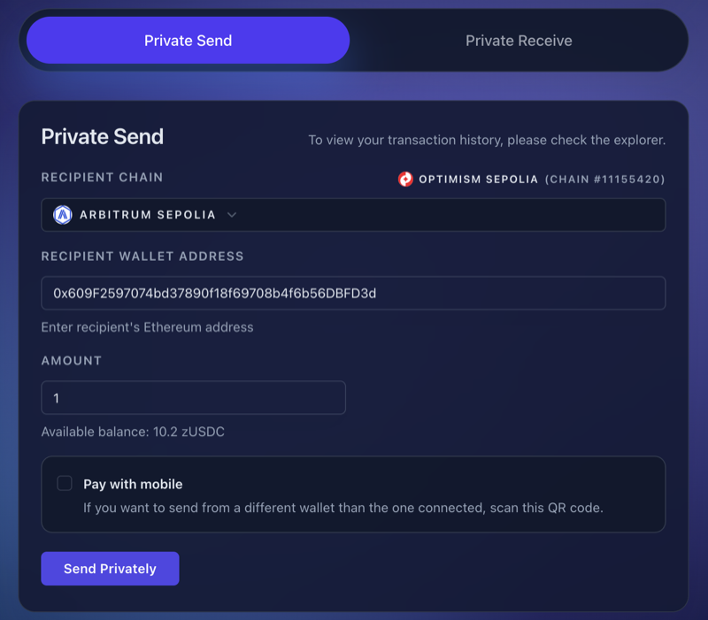
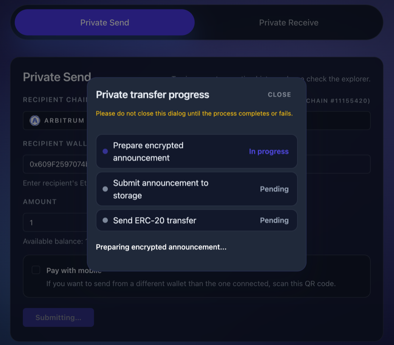
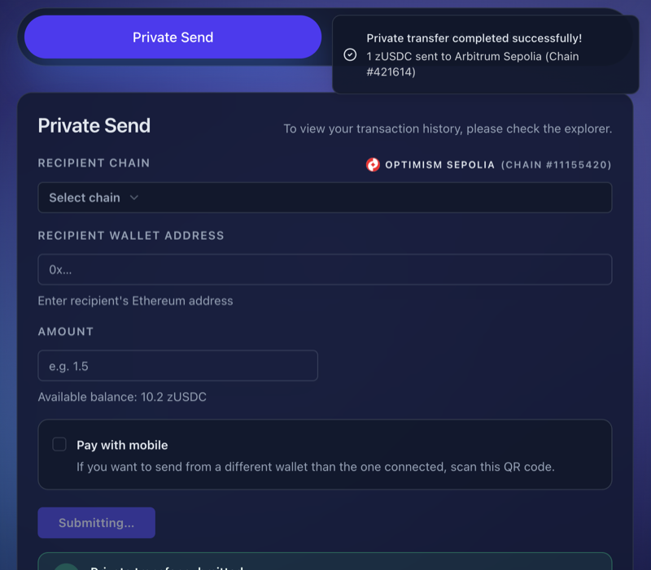
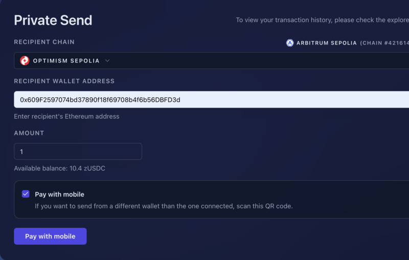
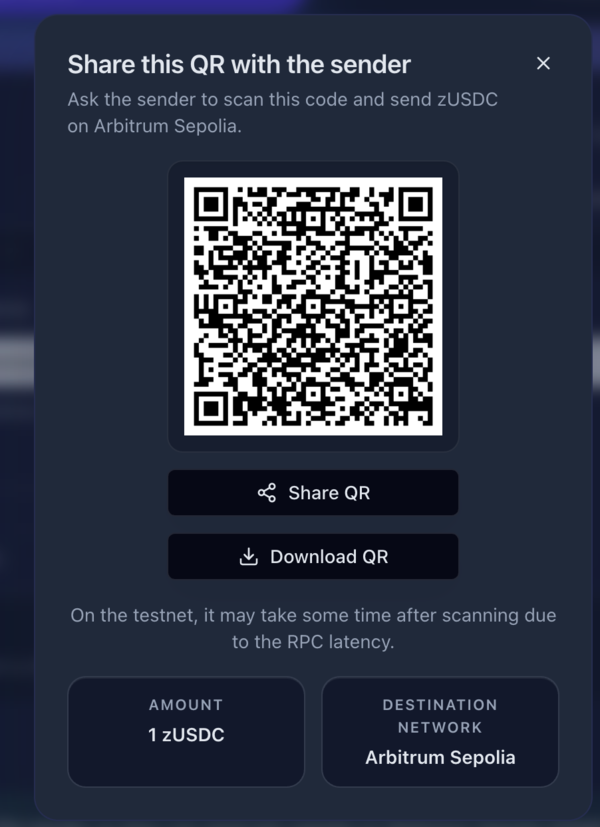

# Private Transfer (Frontend)

This guide explains how to send and receive private transfers using the zERC20 web application.

## Sending a Private Payment

### To a Known Address

If you know the recipient's address:

1. Visit the [Frontend](https://v2.testnet.app.zerc20.io/)
2. Click the "Private Send" tab
3. Select the recipient chain from the dropdown
4. Enter the recipient's Ethereum address
5. Enter the amount of zERC20 to send
6. Click "Send Privately"

<figure><figcaption>Private Send Form</figcaption></figure>

The transfer will process in three steps:

1. **Generate**: The system generates a burn address and encrypted announcement
2. **Store**: The encrypted announcement is stored on-chain or off-chain for the recipient to scan later
3. **Transfer**: Your tokens are sent to the burn address

<figure><figcaption>Transfer Progress</figcaption></figure>

Once completed, you'll see a success message:

<figure><figcaption>Transfer Success</figcaption></figure>

### To a Burn Address

If someone provides you with a burn address:

1. Open MetaMask (or any wallet)
2. Send zERC20 to the provided burn address
3. Done — the recipient handles the withdrawal

You can send from any supported chain. This method is useful when the recipient wants to maintain privacy even from the sender.

## Creating a Burn Address for Others

The "Pay with mobile" feature allows you to create a burn address that others can pay to. This is useful for:

- Receiving payments without revealing your withdrawal address to payers
- Creating payment requests that can be shared via QR code
- Allowing someone else to pay on behalf of a recipient

To create a burn address:

1. Go to the Send page
2. Enter the recipient's withdrawal address and amount
3. Check the **"Pay with mobile"** option
4. Click "Pay with mobile"

<figure><figcaption>Pay with Mobile Form</figcaption></figure>

5. A QR code will be generated containing the burn address
6. Share the QR code with anyone who needs to pay

<figure><figcaption>Pay with Mobile QR</figcaption></figure>

The payer simply scans the QR code and sends the exact amount to the displayed burn address. Once the payment is confirmed on-chain, the recipient can withdraw the funds.

## Receiving and Withdrawing

See [Scan Receives](scan-receives.md) for detailed instructions on receiving and withdrawing private transfers.
