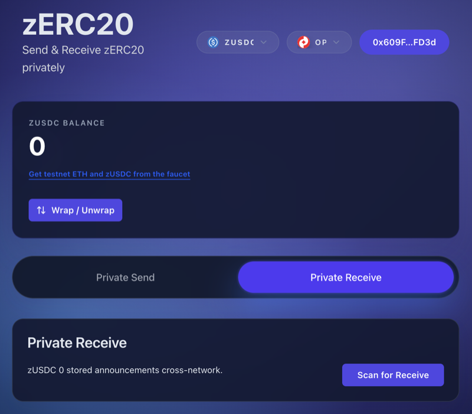
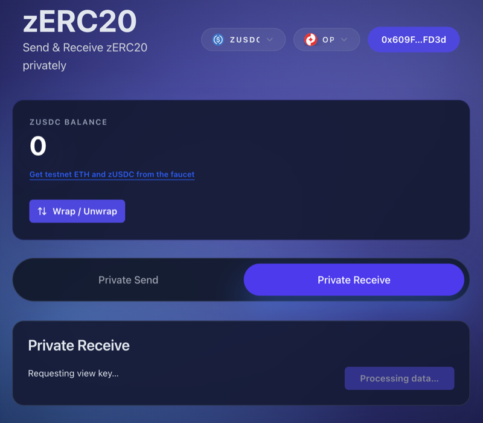
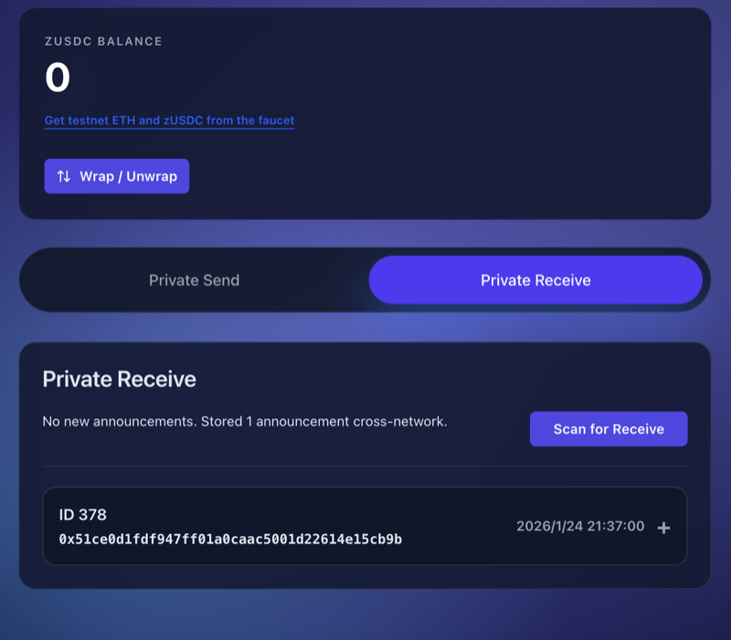
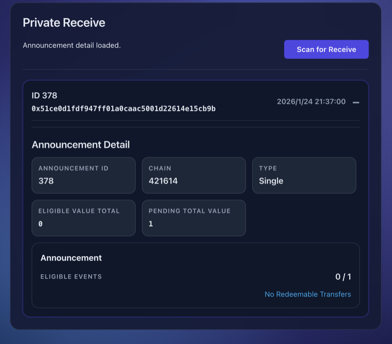
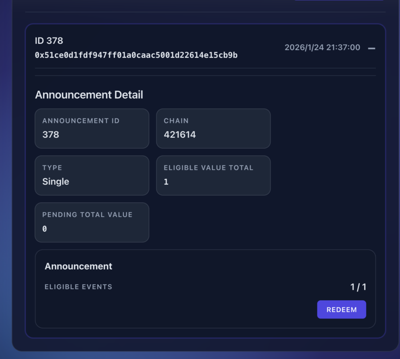
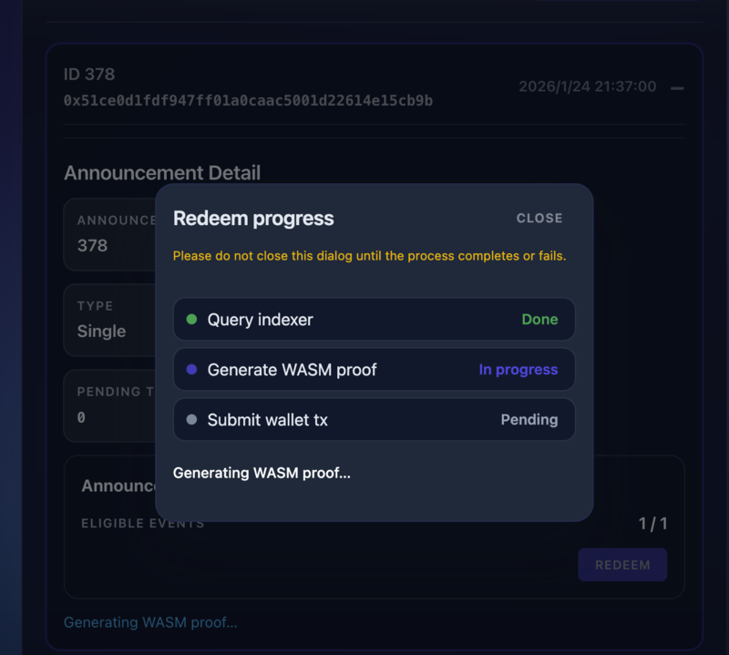
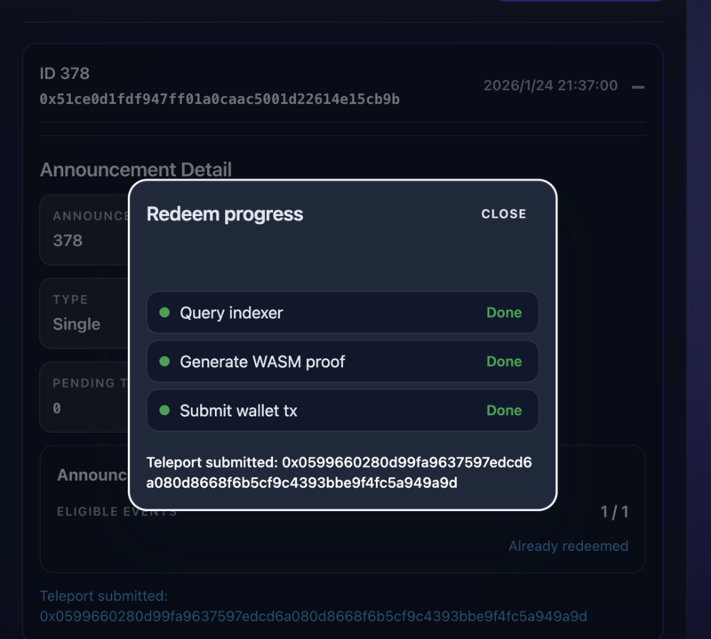

# Scan Receives (Frontend)

This guide explains how to scan for and receive private transfers using the zERC20 web application.

## Accessing Private Receive

1. Visit the [Frontend](https://app.zerc20.io/)
2. Connect your wallet
3. Click the "Private Receive" tab

<figure><figcaption>Private Receive Tab</figcaption></figure>

## Scanning for Incoming Transfers

To check for incoming private transfers:

1. Click the "Scan for Receive" button
2. The system will request your view key and scan for announcements

<figure><figcaption>Scanning Progress</figcaption></figure>

The scanning process:
- Requests your view key from your wallet (this key allows decryption of announcements addressed to you)
- Searches for encrypted announcements across all supported chains
- Decrypts announcements addressed to your wallet
- Does not reveal your private key or spending capability

## Viewing Received Transfers

After scanning, you'll see a list of incoming transfers:

<figure><figcaption>Announcement List</figcaption></figure>

Each announcement shows:
- **ID**: Unique identifier for the transfer
- **Transaction Hash**: The on-chain transaction reference
- **Timestamp**: When the transfer was made

## Announcement Details

Click on an announcement to view its details:

<figure><figcaption>Announcement Detail</figcaption></figure>

The detail view shows:
- **Announcement ID**: Unique identifier
- **Chain**: The chain where the transfer originated
- **Type**: Single or batch transfer
- **Eligible Value Total**: Amount already claimed
- **Pending Total Value**: Amount available to withdraw
- **Eligible Events**: Number of redeemable transfers

## Withdrawing Funds

Once you have eligible transfers:

1. Click on the announcement with pending value
2. Click the "REDEEM" button

<figure><figcaption>Redeem Detail</figcaption></figure>

3. Wait for the proof generation process (this creates a zero-knowledge proof that you are entitled to withdraw the funds)

<figure><figcaption>Proof generation and transaction in progress</figcaption></figure>

4. Wait for the transaction to complete

<figure><figcaption>Redeem Success</figcaption></figure>

The funds will be transferred to your connected wallet address.

## Troubleshooting

### No Announcements Found

If scanning shows no results:
- Ensure you're connected with the correct wallet
- Wait for the transfer to be confirmed on-chain (may take a few minutes)
- Check that the sender used the correct recipient address

## Next Steps

- [Private Transfer](private-transfer.md) - Learn how to send private transfers
- [Getting Started](getting-started.md) - Overview of the frontend
- [FAQ](../faq.md) - Common questions and troubleshooting
